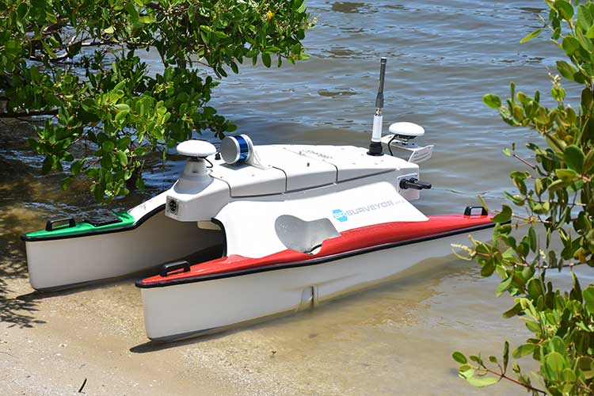
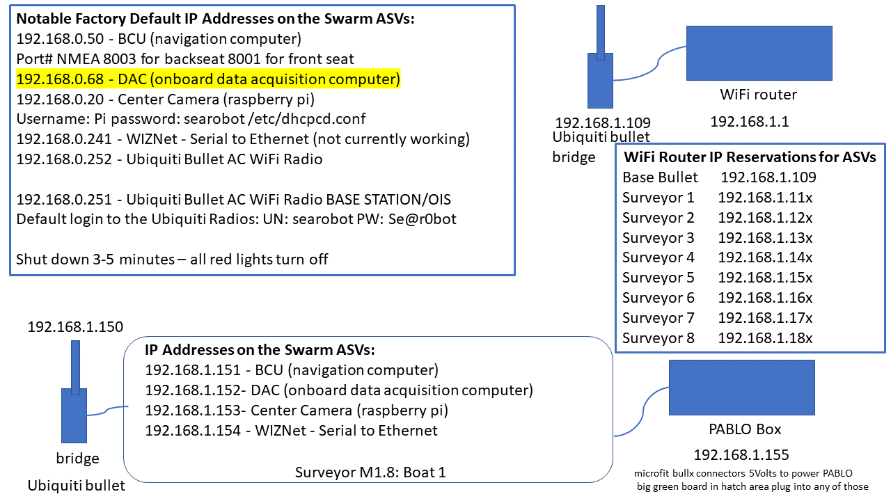
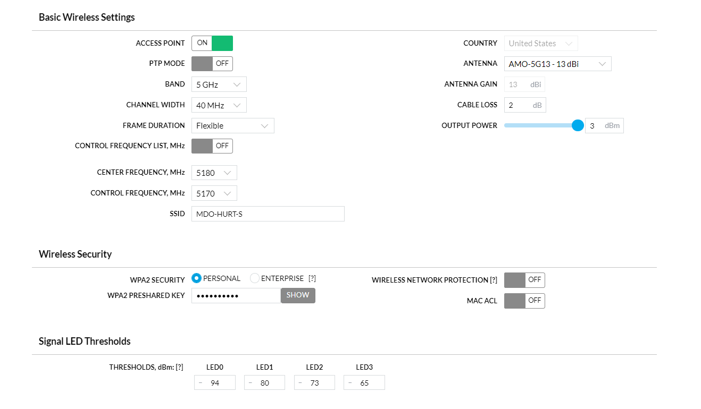
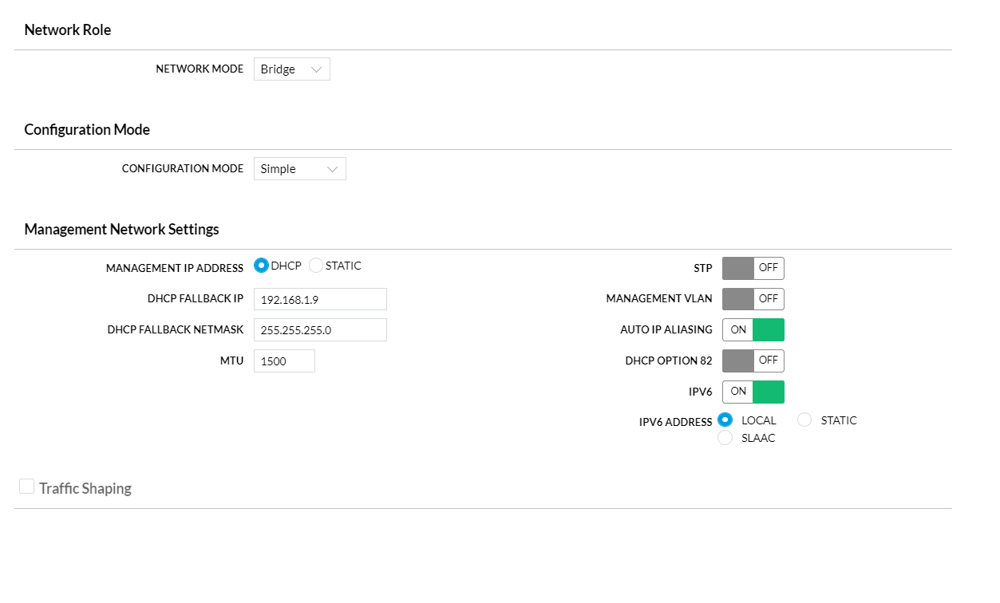
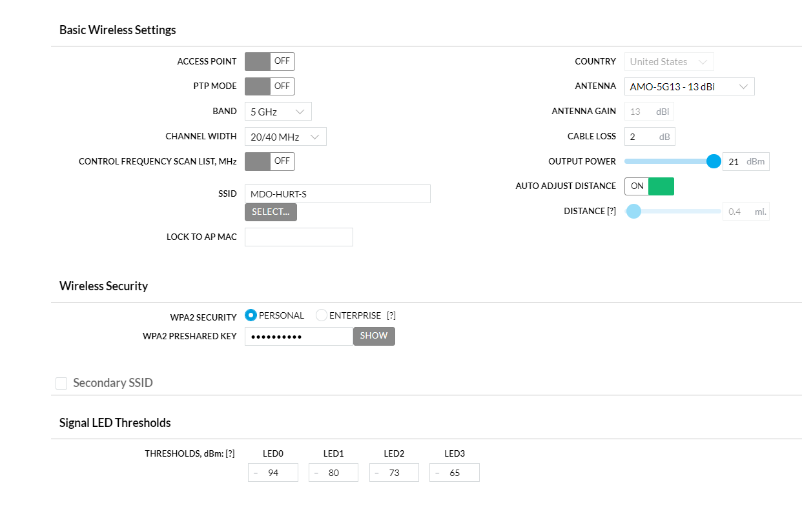
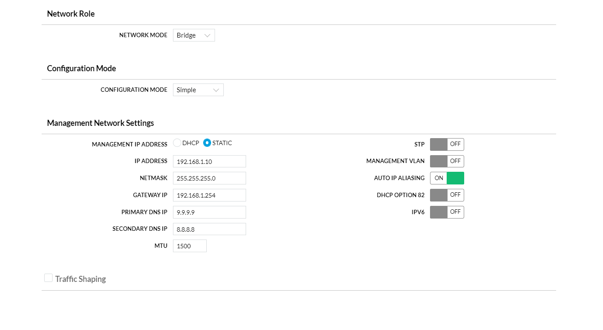

# MDO-HuRT-S
Multi-domain Operations Human-Robot Teaming Sandbox (MDO-HuRT-S). This repository is to document the autonomous robot setup for use in the MDO-HuRT-S.

### ENABLE Backseat Port
edit the file /searobot/COMM.cfg
between lines 'LLC' and 'HCU' lines
add 'OP2 127.0.0.1 8003'
then reboot

#### On OIS software
Enable Secondary Control on the 'Commands to USV' GUI

### BCU is 192.168.1.x1
port 8001 is for the OIS/shorside/joystick
port 8003 is for the backseat/DAC

### netcat to connect to "Front Seat" Nav Computer
#### TO READ
netcat <IP> <port>
for example: netcat 192.168.1.21 8003

#### To WRITE
  echo '$PSEAC,T,,20,-10,THR_ON*02' | netcat 192.168.1.21 8003

### SeaRobotics Surveyor M1.8 -- Autonomous Surface Vehicle (ASV)

The bedrock of MDO-HuRT-S is the [SeaRobotics Surveyor M1.8](https://www.searobotics.com/products/autonomous-surface-vehicles/sr-surveyor-class) without any water sampling or lidar sensors.

#### Ubiquiti AC Bullet: Base Access Point
Connected to the router, this Ubiquiti AC Bullet is the Access Point to all the ASVs. 
  
The bullets have been sent to us with two different passwords ---- username: searobot ---- password Se@r0bot or Sear0bot
  
 firmware ---- Air0S8 -> 2WA.V8.7.11 ---- Build Number: 46972

  
   

#### Ubiquiti AC Bullet: ASV
Each ASV has its own dedicated Ubiquiti AC Bullet WiFi radio attached in bridge mode.
  

  
  
#### BCU (navigation computer)
  Changing BCU ip ----
On the laptop provided open WinSCP ----
Log in ----
    protocol : SFTP ----
    Host name: BCU current ip (factory default is 192.168.0.50) ----
    Username: root ----
    Password: searobot ----
On the right side follow the file path ../etc/network ----
Open the interfaces text file ----
Edit the ip’s

#### DAC (data acquisition computer) (named searobot01/02/ect)
  logging into DAC with hdmi ---- when turned on a purple screen will come up because of monitor issues ---- work around this by pressing enter, your password, then enter again ---- this will log you in ---- right click the background and change monitor settings
  
  flashing ubuntu onto DAC ----
  DAC has hdmi port inside the USV and usb ports on the outside. ----
  after flashing the DAC thinks there is another monitor which makes this a struggle, but there are work arounds ----
  after flashing there is a blank screen. press shift-tab enter to bring ubuntu installer onto your monitor. follow the prompts
  

#### Center Camera
  Changing camera (raspberry pi) ip ----
ssh pi@(camera ip) (default 192.168.0.20) ---- 
Password: searobot ----
sudo nano /etc/dhcpcd.conf ----
Change ip’s
  
#### wiznet
  Changing wiznet ip ----
Download wiznet configuration tool
https://github.com/Wiznet/WIZnet-S2E-Tool-GUI/releases/download/V1.5.0/wizconfig-V1.5.0.exe ----
click device search ----
Click on the mac address of the robot ----
Change ip’s

